实验目的：搭建Android运行的环境

实验要求：安装工具链并运行HelloWord程序

实验内容：

**一、Git:**

1、进入官网https://git-scm.com/download进行下载

 

2、 点击下载好的安装包并进行安装：

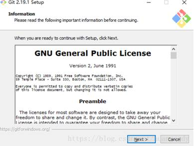

 

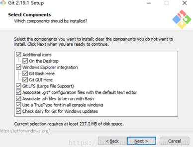

 

 

 

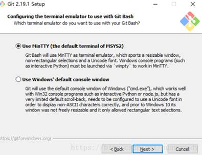

 

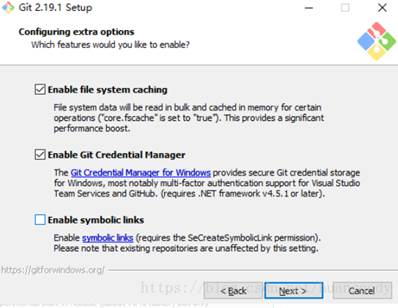

 

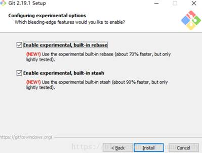

 

3、安装成功

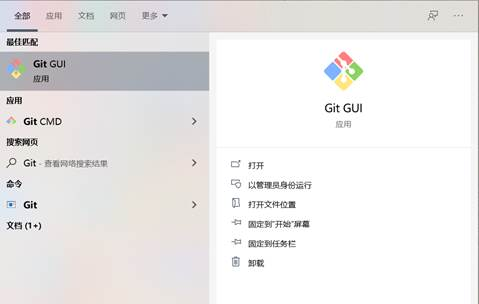

二、GitHub:

SSH授权管理：

1、点击GitHub个人头像，进入Setting，并选择SSH和GPG keys:

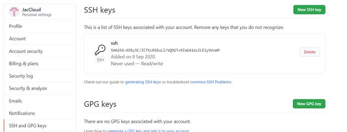

 

2、点击New SSH key:

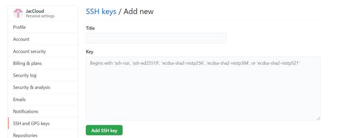

 

3、在Title位置填写一个合适的名称，然后打开SourceTree，点击工具，选择创建或导入SSH密钥：

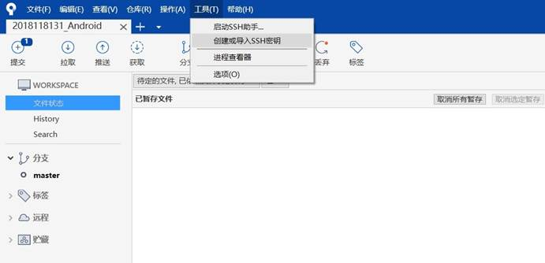

 

4、点击Generate：

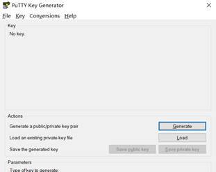  

 

5、设置密码，然后点击Save private key,保存PPK文件

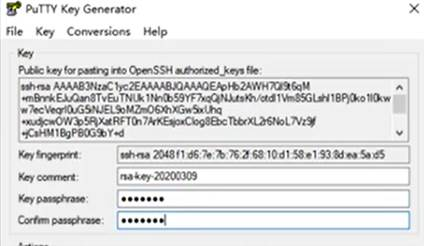 

 

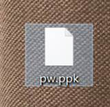

 

6、复制公钥，并粘贴到GitHub中：

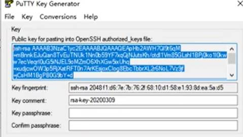

 

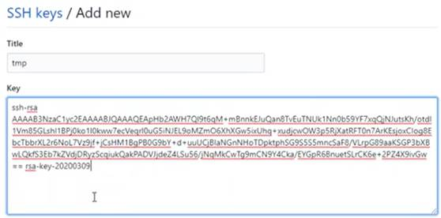

三、SourceTree:

连接到云端的GitHub：

1、 点击SourceTree右上角的设置：

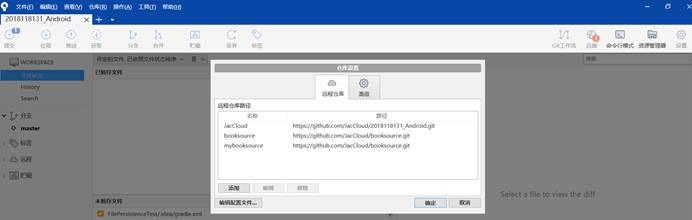

 

 

 

2、 点击添加，并打开GitHub，选择克隆并复制SSH：

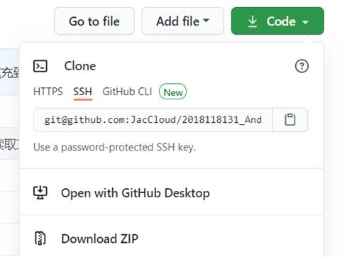

 

 

 

3、 将复制好的SSH粘贴到URL并点击确定：

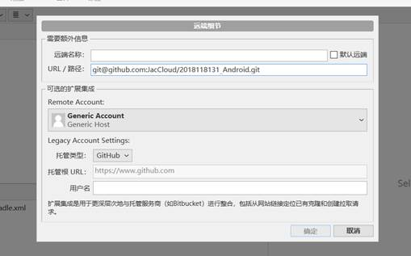

四：MarkDown:

1、 下载并安装好Typora:

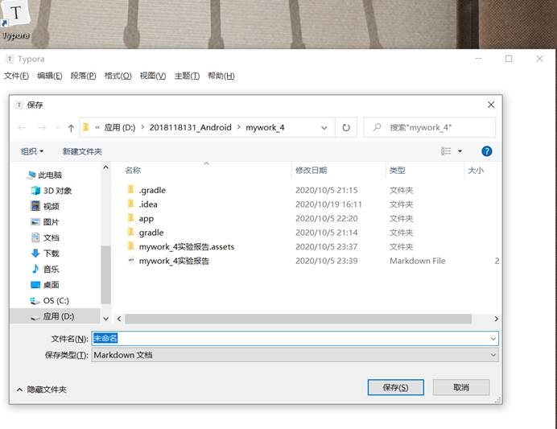

五、Android Studio：

1、 下载Android studio安装包，可以从 http://www.android-studio.org/ 下载最新版本

 

2、 点击安装包，选择Next：

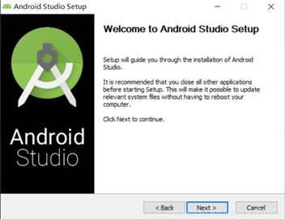

 

3、 选择安装的路径：

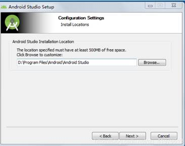

4、 选择第二个：

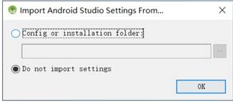

 

5、 安装SDK：

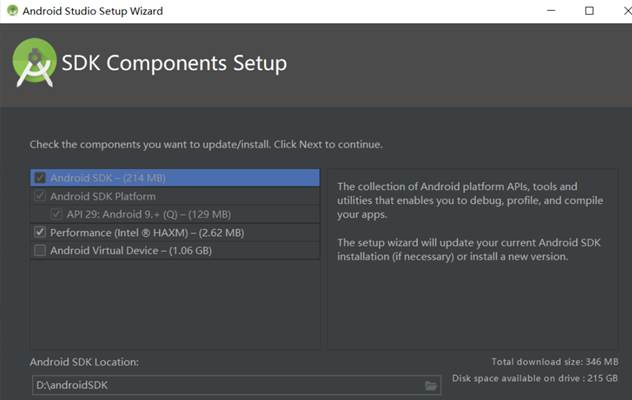

 

6、 选择内存：

 

 

 

7、 安装成功：

六、运行HelloWord程序：

1、选择新建一个项目：

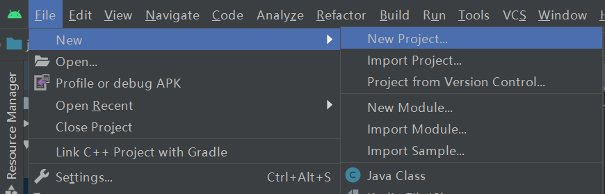

2、选择Empty Activity:

3、给项目重新起名：

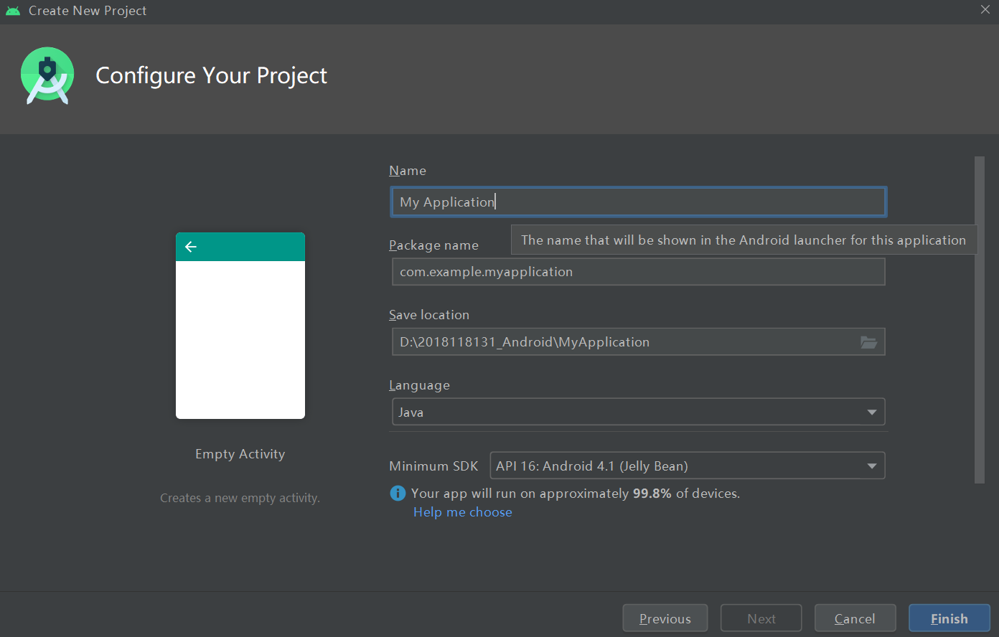

4、运行结果：

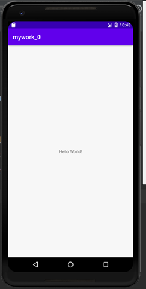