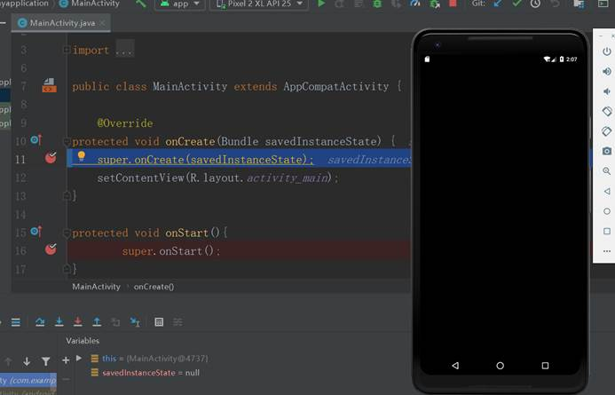

**实验目的：掌握活动的生命周期**

**实验要求：在不同的回调函数下，展示触发条件和运行过程**

**实验内容：**

首先先设置好断点，再启动DeBug模式

 

1、 执行OnCreate()函数

 

 

 

 

2、 执行OnStart()函数

 

3、 执行OnResum()函数

 

运行完OnResume()函数后，显示出活动

 

4、 按Home键返回主界面，将执行OnPause()函数

 

5、 执行OnStop()函数

 

6、 执行OnDestroy()函数

 

7、 执行OnRestart()函数后，会立即跳到OnCreate()函数，等再运行到OnResume函数时，活动会再次显示出来

 

**实验总结：**

使用Android Studio的Debug模式，逐渐理解函数生命周期的启动、结束过程

 

 