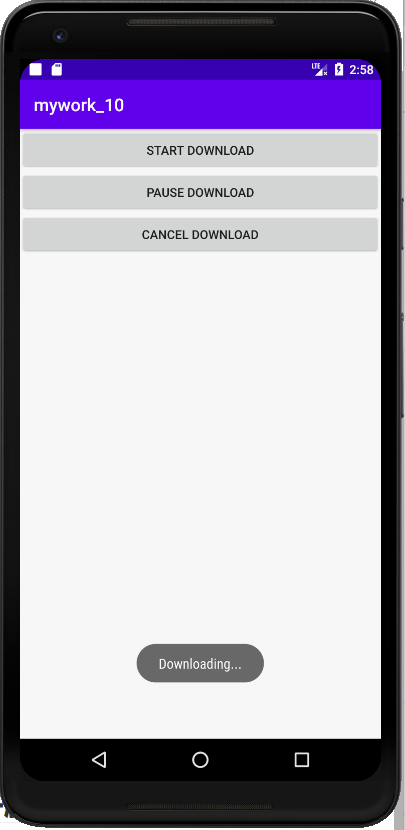
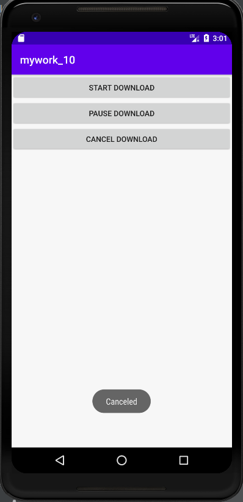

# 实验目的：

掌握子服务与多线程

# 实验要求：

子服务的绑定，子服务代码运行在异步任务

# 实验内容：

## 点击StartDownload进行下载，下拉查看进度

下载成功

## 点击PauseDonwnload暂停下载

## 点击Cancel Download取消下载并将文件删除

# 实验总结：

通过本次实验，掌握了Android完整版的下载实例，更加深刻理解并掌握了Android中子服务的绑定与异步任务