设置了四个按钮，每个按钮对应一个活动和一种启动模式

STANDARD按钮对应MainActivity和standard启动模式

SINGLETOP按钮对应SecondActivity和singletop启动模式

SINGLETASK按钮对应ThirdActivity和singletask启动模式

SINGLEINSTANCE按钮对应FourthActivity和singleInstance启动模式

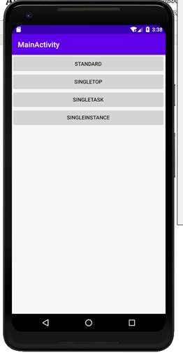

 

 

 

 

 

 

 

 

一、standard模式：

连续按三次STANDARD按钮，界面连续闪动三次并且都进入MainActivy，说明创建了三个实例

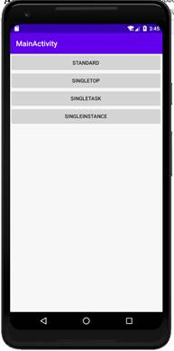

 

连续按三次返回键，界面闪动三次，并都是返回到MainActivity界面

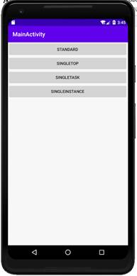

所以，standard模式每次启动都会创建该活动的一个新实例

 

二、singleTop模式：

1、连续按三次SINGLETOP按钮，发现界面只闪动了一次并进入SecondActivity，说明只创建了一个实例

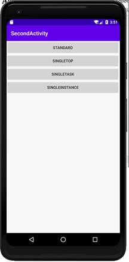

当按一次返回键后，界面闪动一次并直接返回到MainActivity，而不是返回两次SecondActivity,所以以singleTop模式启动，如果返回栈的栈顶是该活动，那么便不会再创建新的活动实例

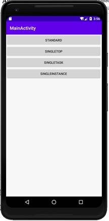

 

2、先按一次SINGLETOP，进入SecondActivity,再按一次STANDARD，进入MainActivity，再按一次SINGLETOP，进入SecondActivity

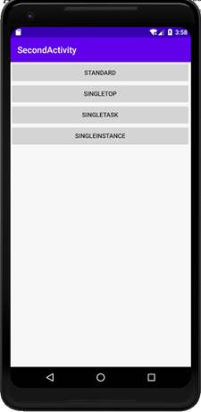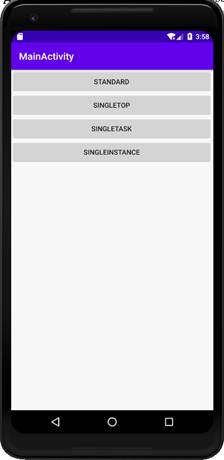

 

按三次返回键，可以发现SecondActivity有两个实例，说明singleTop模式下活动如果不是在栈顶便会再创建新的活动。

 

 

 

 

 

 

三、singleTask模式

先按一次SINGLETASK按钮进入ThirdActivity，再按两次STANDARD按钮创建两个MainActivity，再按一次SINGTASK按钮进入ThirdActivity

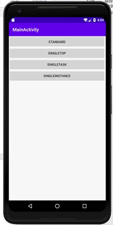

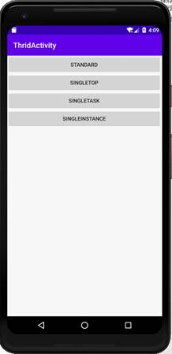

 

 

当按一次返回键时，返回到MainActivity，再按一次返回键，便回到主界面

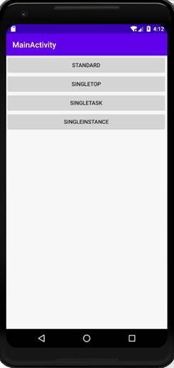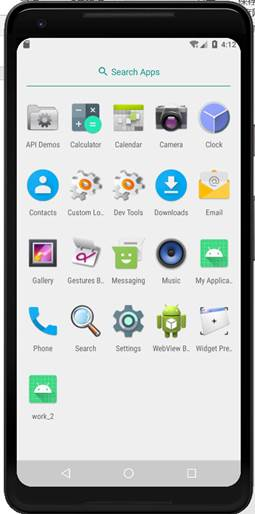

这说明singleTask模式启动会让活动在整个应用程序中只存在一个实例，当已经存在一个实例时，会把这个活动之上的所有活动全部出栈。

 

 

 

 

 

 

 

四、singleInstance模式：

先按一次SINGLEINSTANCE按钮进入FourthActivity，再按一次STANDARD按钮进入MainActivity

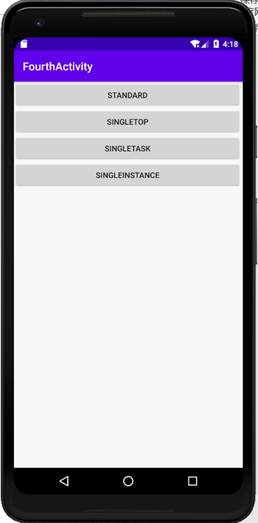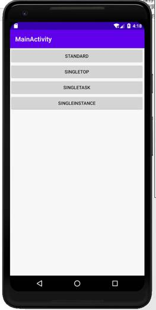

当按下返回键时，先回到MainActivity，再按下返回键，回到FourthActivity，再按返回键，回到主界面

 

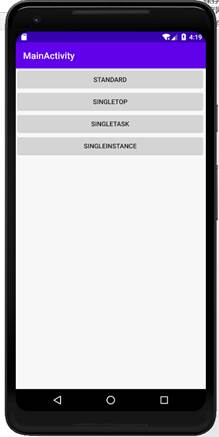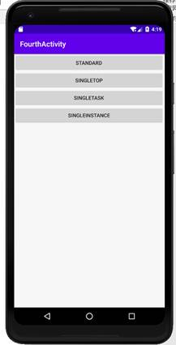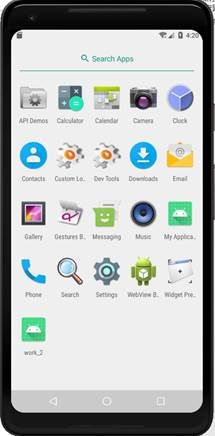

singleInstance模式的活动会用一个单独的返回栈来管理。退出时，会等管理程序的返回栈先完成退出后才会对管理singleInstance模式活动的返回栈进行退出。

 