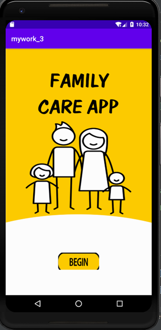
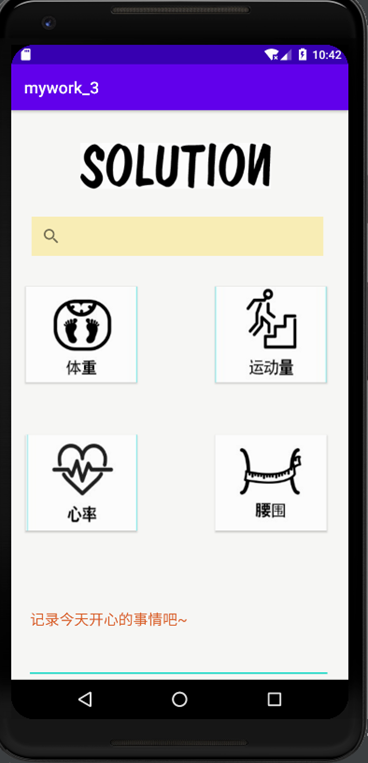
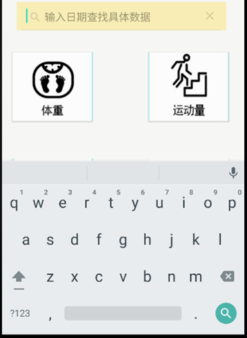
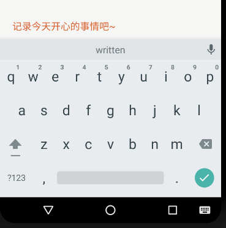
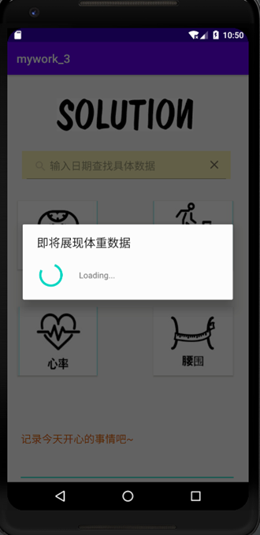
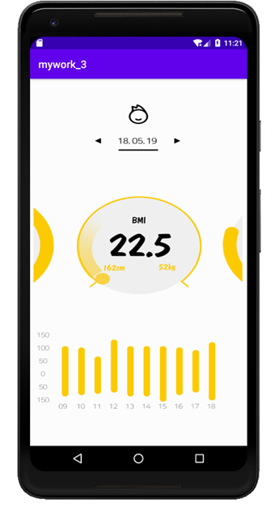

**实验目的：**掌握安卓各种控件和布局的特点和属性

**实验要求：**使用不同的布局和控件制作UI界面。

**实验内容：**

 

1、     创建开始界面，先设置背景图片，再添加相对布局，在相对布局中添加BEGIN按钮：

 

2、     在MainActivity类中添加对BEGIN按钮的响应处理，点击按钮后跳转到主界面。

 

3、     创建主界面，先添加相对布局，再逐个添加ImageView、SearchView、Button、EditText组件，并调整好位置

 

（1）、ImageView组件中使用SOLUTION图片作为背景

（2）、SearchView组件中使用黄色的背景并添加提示文字（输入日期查找具体的数据）：

 

（3）、Button组件中使用四张不用的图片作为按钮背景

（4）、EditView组件中使用红色的提示性文字（记录今天开心的事情吧~）

 

 

4、     在SecondActivity类为体重按钮添加响应处理，当点击按钮后弹出弹框

 

5、     创建第三个界面，并在SecondActivity类添加对腰围按钮的响应处理，点击按钮后，跳转到新界面

 

**实验总结：**

通过本次实验，熟练掌握了各种布局和组件的使用，以及它们的特性，在调整组件位置时要考虑当前使用的布局，根据布局特点进行调整。