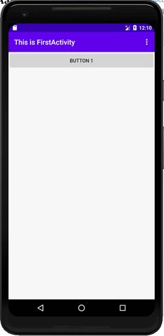
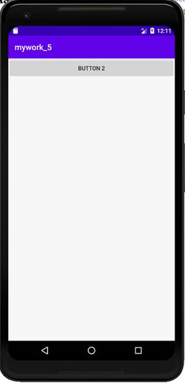
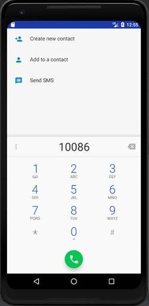
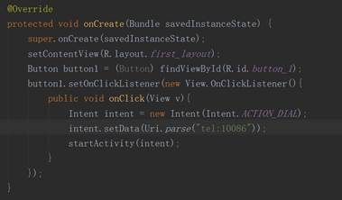

**实验目的：掌握显示和隐式意图的应用**

**实验要求：使用显示意图、系统内置隐含意图切换界面和程序**

**实验内容：**

**一、显示意图**（点击Button 1切换两个界面）：

 

   

**二、隐式意图：**

1、点击Button 1调用系统的浏览器打开百度网页：

 

 

2、点击Button 1调用系统拨号界面：

 

 

**实验总结：**

通过本次实验，深刻理解了Android中Intent的工作方式，让多个应用程序之间的功能共享成为了可能。显示意图直接指明了启动哪个活动，隐式意图则是指定了一系列更为抽象的action和category等信息，交由系统分析并找到合适的活动去启动。