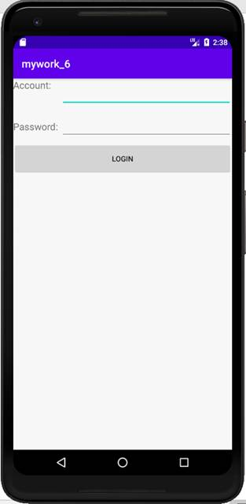
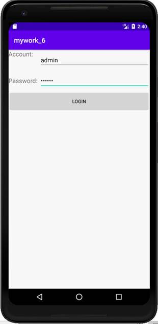
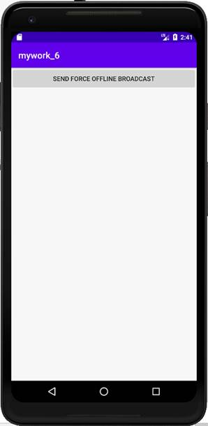
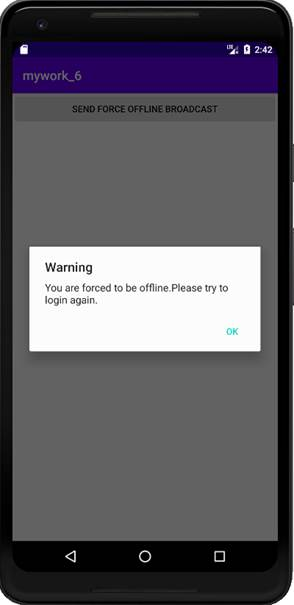
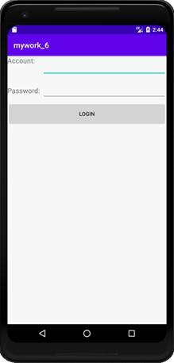

**实验目的：掌握广播、自定义广播的使用**

 

**实验要求：实现强制下线功能**

 

**实验内容：**

1、 首先进入到登录界面，输入账号和密码

 

 

2、 如果账号是admin，密码是123456，点击按钮就会进入到程序的主界面：

 

 

3、 点击发送广播的按钮，会发送一条强制下线的广播，弹出对话框提示用户已被强制下线：

 

4、 用户无法对界面的任何元素进行操作，只能点击确定按钮重新回到登录界面。

**实验总结：**

通过本次实验，熟练掌握Android中的广播机制，以及广播的发送和截断：有序广播的接收器有先后顺序并且可以截断广播，阻止其继续传播。本地广播只能够在程序内部进行传递。