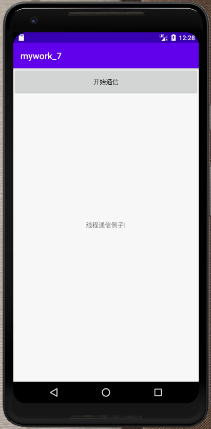
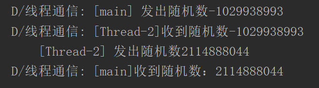
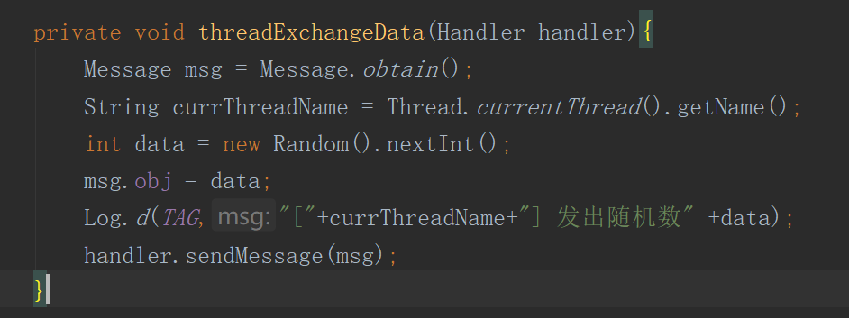
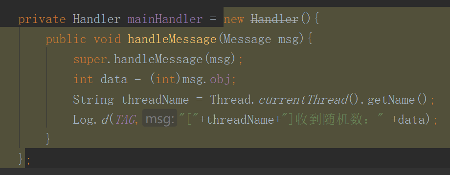
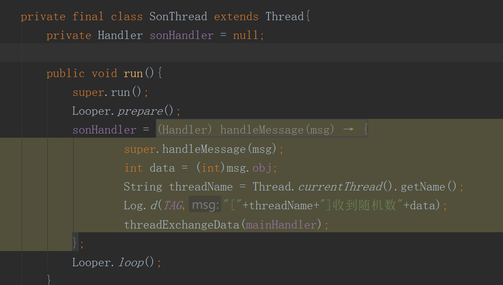
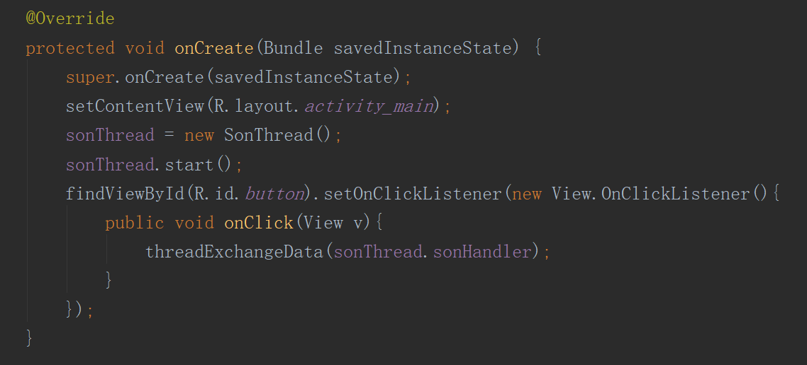

# 实验目的：

掌握Android多线程技术

# 实验要求：

创建Android子线程的程序框架，消息处理机制和多线程之间的数据交换

# 实验内容：

## 点击开始通信按钮：

## 打开控制台查看通信信息：

## 代码分析：

### 用于线程通信的方法

在此方法中，可以发送一条随机数消息

### 主线程的Handler：

### 子线程：

在子线程中初始刷了Looper,子线程发送一条消息给主线程，最后启动消息循环

### 按钮响应：

点击按钮后开启线程通信，在主线程中给子线程发送消息

# 实验总结：

通过本次实验，更加熟练使用并理解了Android中主线程与子线程进行消息传递和消息处理的机制