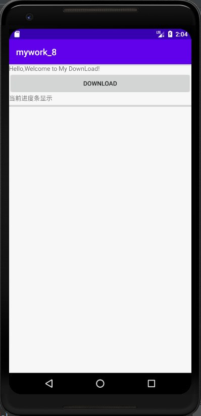
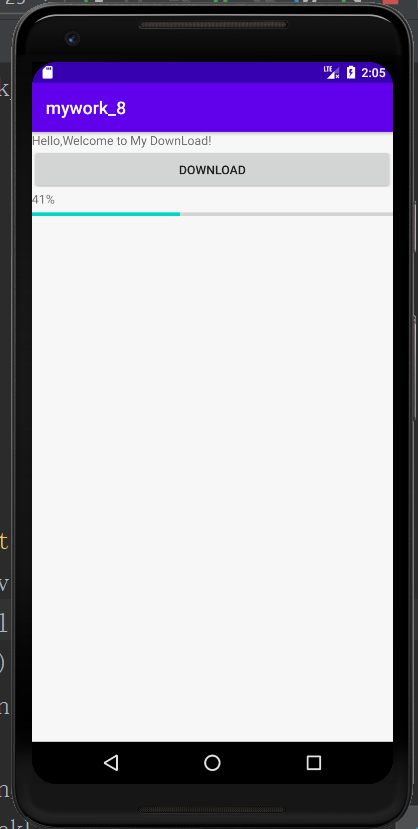
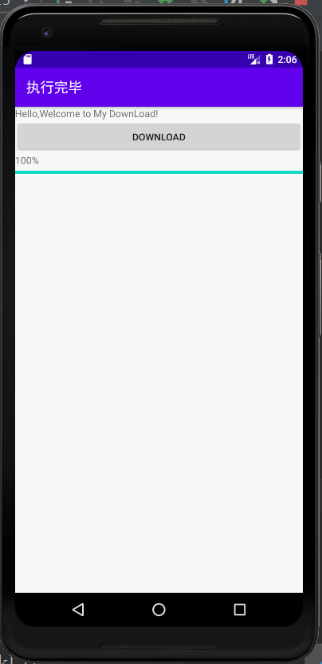
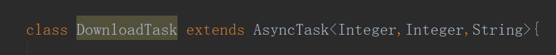
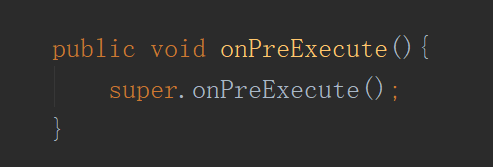
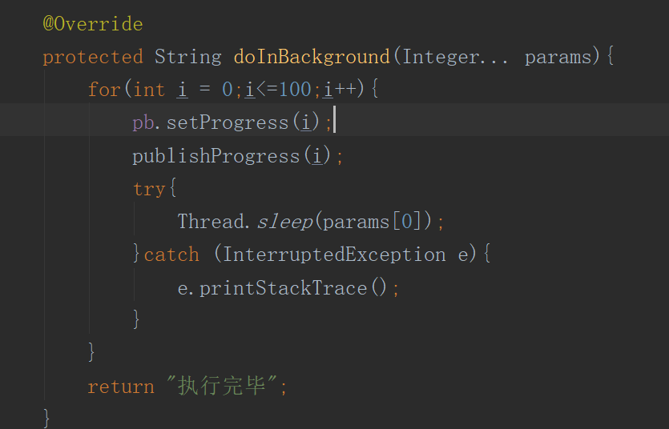
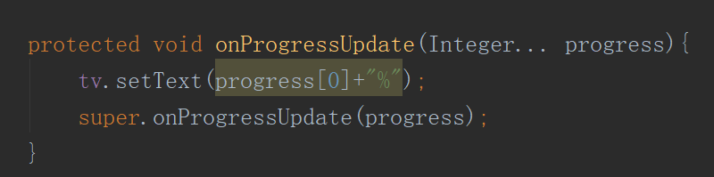
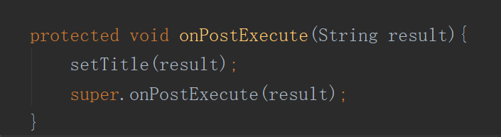

# 实验目的：

掌握异步任务的隐含子线程程序框架

# 实验要求：

使用AsyncTask对异步消息进行处理

# 实验内容：

## 点击DownLoad按钮进行模拟下载

## 下载完毕：

## 代码分析：

### 定义一个类继承AsyncTask:

三个参数分别代表线程休息时间，进度，返回值

### 第一个执行的方法:

该方法将在执行实际的后台操作前被UI 线程调用。可以在该方法中做一些准备工作，如在界面上显示一个进度条，或者一些控件的实例化

### 第二个执行方法：

在onPreExecute（）方法执行后马上执行，该方法运行在后台线程中。这里将主要负责执行那些很耗时的后台处理工作。

### onProgressUpdate():

在publishProgress方法被调用后，UI 线程将调用这个方法从而在界面上展示任务的进展情况，例如通过一个进度条进行展示。

### onPostExecute():

在doInBackground 执行完成后，onPostExecute 方法将被UI 线程调用，后台的计算结果将通过该方法传递到UI 线程，并且在界面上展示给用户

# 实验总结：

通过本次实验，更加深刻理解了Android异步消息处理机制，熟练使用Android提供的AsyncTask类实现异步任务。

