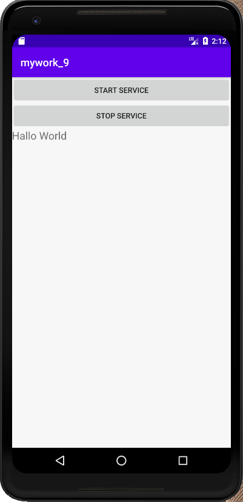
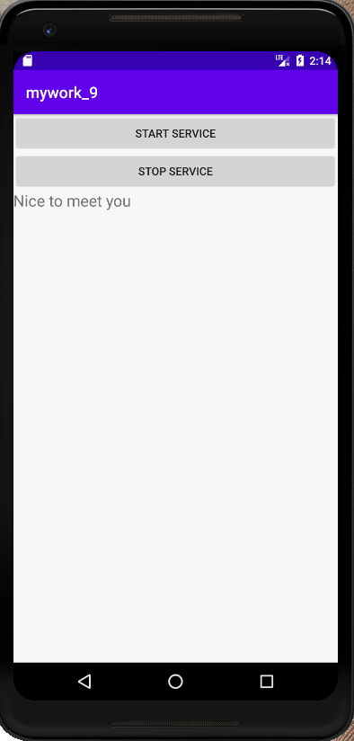
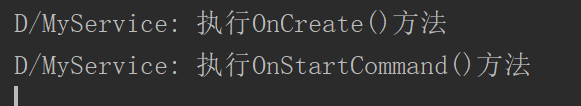
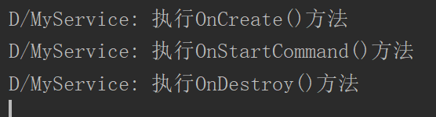
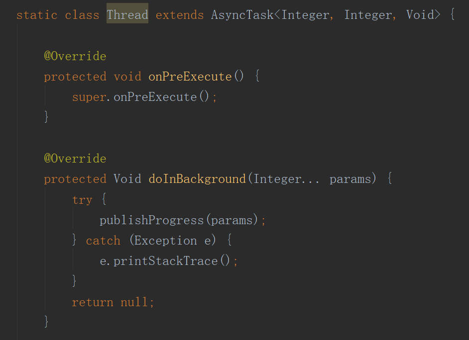
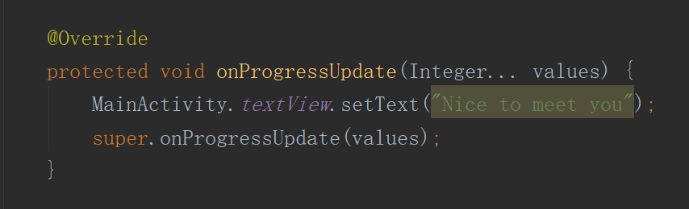
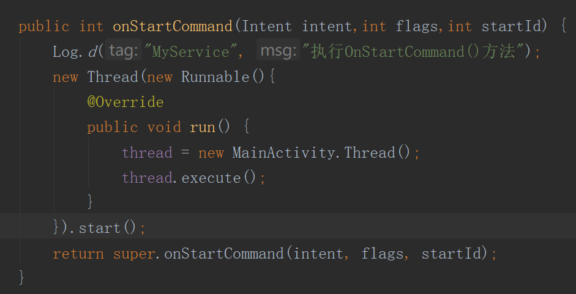

# 实验目的：

掌握服务和线程通信

# 实验要求：

启动和停止服务，服务代码运行在显示子线程。

# 实验内容：

## 点击Start Service按钮启动服务和开启子线程更改文本内容：

控制台打印出Service类调用的方法，同时子线程更改TextVIew中的内容，从Hallo World更改为Nice to meet you

## 点击Stop Service结束服务：

控制台打印出Service类调用了OnDestroy()方法

## 代码分析：

### 在MainActivity中定义了继承AsyncTask类的Thread类

### Thread类中的onProgressUpdate()方法对UI界面进行更新

### Service类创建Thread类的对象并在onStartCommand()方法中开启子线程：

# 实验总结：

通过本次实验，掌握了如何开启和关闭一个服务，同时更加深刻理解并掌握了Android多线程的机制，让服务代码运行在子线程中。